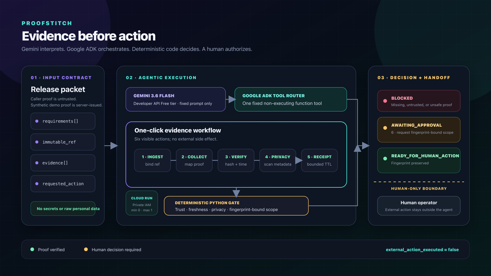

# ProofStitch

ProofStitch is a release steward built with Gemini 3.6 Flash and Google's Agent Development Kit. It checks whether each release claim has current, non-sensitive evidence from the right source ref, records a SHA-256 receipt, and stops before an external action unless a human has approved the exact evidence contract.

The project targets the Taskmaster category of the 2026 All Things Agentic Hackathon.

## How decisions work

ProofStitch returns four states:

1. `BLOCKED`: required evidence is missing, untrusted, stale, failed, sensitive, or tied to another ref.
2. `AWAITING_APPROVAL`: trusted evidence passes, but the external action has no matching human approval.
3. `READY`: a verified local-only action may continue.
4. `READY_FOR_HUMAN_ACTION`: the server has verified an approval for the exact packet fingerprint. ProofStitch still performs no external action.



Gemini drives one fixed synthetic tool round trip through a Google ADK runner. Typed Python code validates the tool result, owns the gate decision, and renders the human-facing authority statement; provider prose is never treated as approval. The browser dashboard uses a server-built synthetic packet, so it remains useful without model credentials or network access.

## Trust boundaries

- Evidence supplied by an API caller is untrusted by default. Only evidence IDs issued by the server-side synthetic collector can satisfy the demo gate.
- Approval is not accepted inside a caller-controlled packet. The server passes a verified scope through a separate internal argument.
- An approval scope contains `project:action:ref:packet_fingerprint`. Any change to the requirements or evidence invalidates the old scope.
- Only `analyze`, `draft`, `test`, and `validate` are local actions. Every other action fails closed at the human approval boundary.
- Packet fields, list sizes, tool input, HTTP bodies, model calls, response length, and in-memory workflow state are bounded.
- Validation errors never return rejected input. Sensitive values are rejected across the whole packet.
- The production app has no ADK development UI, arbitrary chat route, A2A route, feedback collector, session API, artifact API, or evaluation API.
- The private Cloud Run configuration uses IAM, zero minimum instances, one maximum instance, and one concurrent request per instance. Every Cloud `POST` authenticates the operator capability before reading its body.

## Run locally

Requirements: Python 3.11 through 3.13 and `uv`.

```bash
uv sync --frozen --group dev --extra lint --no-install-project --no-build
uv run --no-sync pytest -q
uv run --no-sync uvicorn app.fast_api_app:app --host 127.0.0.1 --port 8000
```

Open `http://127.0.0.1:8000/proofstitch`. The dashboard and deterministic API work offline.

The production surface contains these routes:

- `GET /healthz`
- `GET /proofstitch`
- `GET /api/v1/demo/{stage}` (`0` or `1`; read-only output never creates approval)
- `POST /api/v1/workflows/demo`
- `POST /api/v1/workflows/{run_id}/synthetic-approval`
- `POST /api/v1/gates/evaluate`
- `POST /api/v1/agent/demo`

`POST /api/v1/agent/demo` accepts no user prompt and is disabled unless a deliberate deployment opens a maximum ten-minute window. During that window it requires `X-ProofStitch-Demo-Intent: fixed-synthetic-demo` plus a 256-bit operator token whose SHA-256 digest alone is configured on the service. It rejects cross-site browser requests, allows three calls per ten minutes, permits one request at a time, limits the run to two model calls, allows exactly one no-argument fixed tool call with a 4 KiB result ceiling, validates that tool's typed deterministic report, and replaces free-form provider prose with the server-owned authority statement before responding. It deletes its in-memory session afterward. Synthetic workflow creation is also limited to three calls per ten minutes, requires `X-ProofStitch-Workflow-Intent: fixed-synthetic-workflow`, rejects cross-site requests, and never evicts an active run when capacity is full. Only the protected, one-shot synthetic-approval route can produce `READY_FOR_HUMAN_ACTION`; read-only demo stages stop before approval. On Cloud Run, every `POST` requires the same operator capability in ASGI middleware before the first body read; the model and workflow routes repeat the check at the route boundary. The dashboard keeps the capability only in a masked input and clears it after approval or reset. Local gate evaluation and offline workflows need no token.

## Verify the release

```bash
./scripts/verify_submission.sh
```

Add `--docker` to build the container and run the local smoke test. The production image copies `uv` from its official multi-architecture image at an immutable digest before applying the hash-locked dependency graph. Live model tests remain skipped unless `RUN_LIVE_MODEL_TESTS=1` is set deliberately with a Gemini Developer API key whose usage remains on the Free tier.

## Deploy privately to Cloud Run

The deployment script requires a fresh dedicated Google Cloud project, a Cloud Run region, a Cloud Tasks location, a least-privileged runtime service account, one Secret Manager secret containing a Gemini Developer API key, a pinned enabled numeric secret version, a fresh 256-bit operator token, and a current Google Cloud CLI with Policy Troubleshooter support. Projects with organization ancestry also require the beta component (`gcloud components install beta`) so principal access boundary policies can be evaluated. Grant the runtime identity `roles/secretmanager.secretAccessor` on that one secret only. Cloud Run, Cloud Build, Artifact Registry, Secret Manager, Cloud Asset Inventory, Policy Troubleshooter, Cloud Tasks, and the required IAM APIs must already be enabled; the runtime does not need a Vertex AI role.

The hackathon credit is treated only as coverage for Google Cloud infrastructure because Google's [discount exclusions](https://cloud.google.com/skus/exclusions) list Generative AI. The model call instead uses the [Gemini Developer API Free tier](https://ai.google.dev/gemini-api/docs/pricing) from a Google AI Studio project that has not been upgraded to Paid. Free-tier content may be used to improve Google products, so ProofStitch sends only its fixed synthetic prompt and fixed synthetic tool result. The script requires separate confirmations for covered infrastructure and the model Free tier. Those confirmations prevent an accidental deploy but do not impose a billing cap. Review the current [Cloud Tasks pricing](https://cloud.google.com/tasks/pricing) before use; the scheduled deletion consumes task operations even though the pricing page currently lists a monthly free tier.

Export only the non-secret deployment settings. Keep the temporary token as an unexported shell variable, and pass it only to the deployment process:

```bash
export PROOFSTITCH_PROJECT_ID="your-dedicated-project"
export PROOFSTITCH_REGION="us-central1"
export PROOFSTITCH_TASKS_LOCATION="us-central1"
export PROOFSTITCH_SERVICE_ACCOUNT="runtime@your-dedicated-project.iam.gserviceaccount.com"
export PROOFSTITCH_GEMINI_SECRET="proofstitch-gemini-api-key"
export PROOFSTITCH_GEMINI_SECRET_VERSION="1"
PROOFSTITCH_MODEL_DEMO_TOKEN="$(openssl rand -hex 32)"
PROOFSTITCH_MODEL_DEMO_TOKEN="${PROOFSTITCH_MODEL_DEMO_TOKEN}" \
PROOFSTITCH_DEPLOY_CONFIRM=DEPLOY_PRIVATE \
PROOFSTITCH_NO_COST_CONFIRMED=YES \
PROOFSTITCH_GEMINI_FREE_TIER_CONFIRMED=YES \
./scripts/deploy_private.sh
```

Create the key in Google AI Studio and store its value directly in Secret Manager without committing, logging, or placing it in a command argument. Use a non-secret Secret Manager ID beginning with `proofstitch-`; the script rejects other namespaces before invoking a child process. Do not set `GOOGLE_API_KEY` or `GEMINI_API_KEY` in the invoking shell; the script refuses raw key input. It verifies the exact secret resource and requires an enabled positive-integer version before making any deployment change. Cloud Run then checks that the runtime identity can access the secret, and injects the pinned version as `GOOGLE_API_KEY` only when an instance starts.

`PROOFSTITCH_SERVICE_ACCOUNT` must be a custom service-account email in the same dedicated project, such as the example above, and must not use the reserved `proofstitch-cleanup` identity. Before invoking any child process, the script validates the exact project binding and identity separation, clears any inherited export attributes on its internal variables, and removes the original environment variable.

The script refuses to reuse an existing `proofstitch` service, cleanup queue, or cleanup service account. It selects Gemini Developer API mode explicitly, deploys the service disabled, grants a fresh cleanup identity delete authority only on that service, checks service-local IAM, and uses Cloud Asset IAM Policy Analyzer to reject `allUsers` or `allAuthenticatedUsers` access inherited from the full project hierarchy. It also requires anonymous probes to return only `401` or `403`.

Before activation, the script grants the Cloud Tasks primary service agent `roles/iam.serviceAccountUser` on the cleanup identity, then asks Policy Troubleshooter to evaluate effective `iam.serviceAccounts.actAs`, `iam.serviceAccounts.getAccessToken`, and `run.services.delete` access. It uses the stable allow-and-deny evaluator for a standalone project and the beta evaluator, including principal access boundary policies, when organization ancestry exists. It accepts only a conclusive `CAN_ACCESS` result; an unavailable or indeterminate check fails closed. It creates and inspects one OAuth-authenticated request to the [Cloud Run v2 delete method](https://cloud.google.com/run/docs/reference/rest/v2/projects.locations.services/delete), including its exact scope and deadline. This follows Google's [authenticated HTTP task setup](https://cloud.google.com/tasks/docs/creating-http-target-tasks). Only after those checks does the script store the operator token's SHA-256 digest and open the service-wide window. Every route returns `503` outside that positive window, which can never exceed ten minutes.

An authorized operator can view the temporary service through an authenticated local proxy. The proxy does not inherit the unexported operator token:

```bash
gcloud run services proxy proofstitch \
  --project="${PROOFSTITCH_PROJECT_ID}" \
  --region="${PROOFSTITCH_REGION}" \
  --port=8080
```

Paste the token into the dashboard's masked Cloud operator field only when advancing the Cloud workflow, and use it for the single recorded model call. Then run `unset PROOFSTITCH_MODEL_DEMO_TOKEN`. Do not place the token in a URL, file, browser storage, log, or commit.

Immediately after recording, keep the scheduled task as a fallback while the cleanup script deletes the service and polls until Cloud Run confirms it is absent:

```bash
PROOFSTITCH_CLEANUP_CONFIRM=DELETE_PRIVATE ./scripts/cleanup_private.sh
```

Only a successful exact-name Cloud Run listing with no matching service confirms absence; authentication, network, or API failures remain an unknown state. Only after confirmed absence does the script remove the dedicated queue and cleanup identity. If direct deletion or confirmation fails, those fallback resources are retained and the command exits non-zero. Delete the dedicated project afterward as the final account-level cleanup.

## License

Apache-2.0. See [LICENSE](LICENSE).
